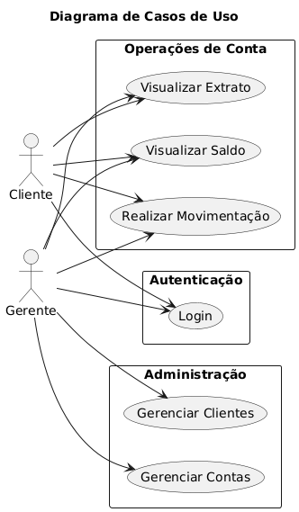
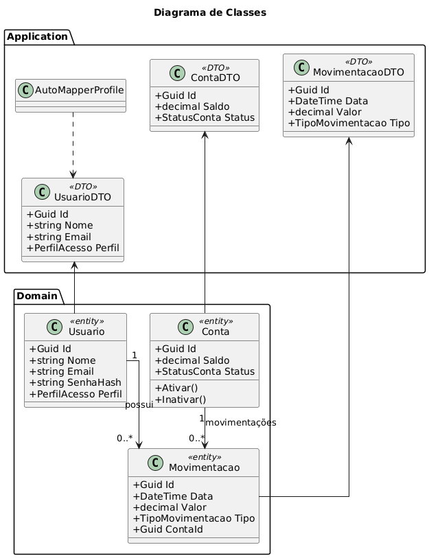
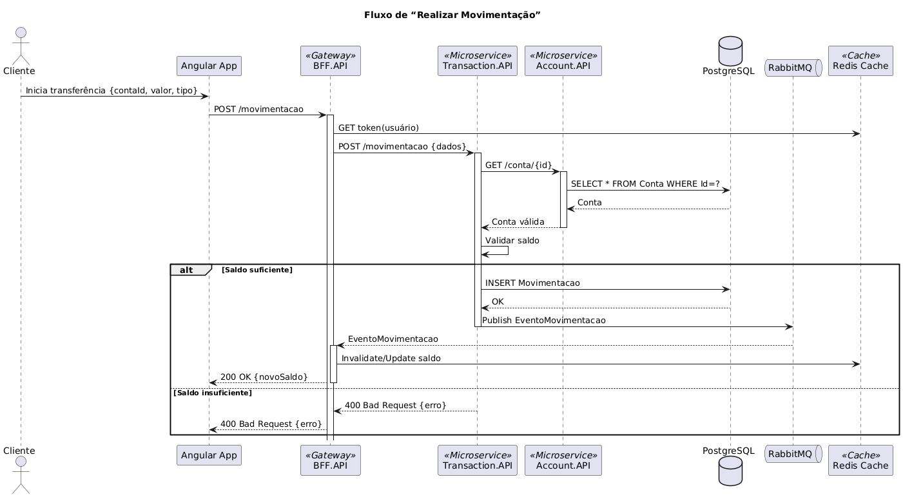
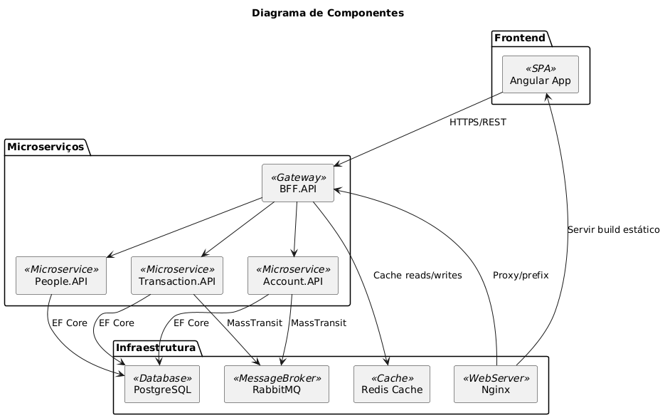
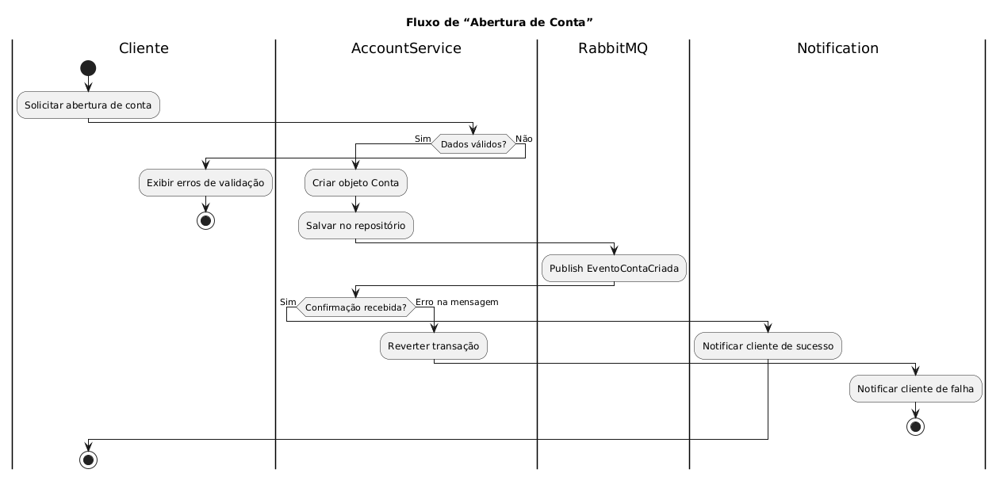

# Teste Técnico para Desenvolvedor Web - BASD (Banco Adventista do Sétimo Dia)

## Descrição Geral

Este projeto consiste no desenvolvimento de uma aplicação web para gerenciamento
e movimentação de contas bancárias para o Banco Adventista do Sétimo Dia (BASD).
O sistema permitirá acesso tanto a clientes quanto a gerentes, utilizando o
mesmo conjunto de credenciais, porém com permissões diferenciadas baseadas no
perfil de acesso.

O sistema deve proporcionar funcionalidades específicas no dashboard de cada
perfil:

- **Clientes:** Realizar movimentações financeiras, visualizar saldo atual e
  extrato por período.
- **Gerentes:** Visualizar todos os clientes e seus saldos, realizar
  movimentações nas contas dos clientes, visualizar extratos das contas dos
  clientes, criar e encerrar contas bancárias.

## Funcionalidades

- **Login:** Acesso diferenciado para cliente e gerente.
- **Dashboard do Cliente:**
  - Realização de movimentações financeiras.
  - Visualização de saldo atual.
  - Visualização de extrato por período.
- **Dashboard do Gerente:**
  - Visualização de todos os clientes e seus saldos.
  - Realização de movimentações nas contas dos clientes.
  - Visualização de extratos das contas dos clientes.
  - Criação e encerramento de contas bancárias.
- **Gerenciamento de Contas:**
  - Contas sem movimentações podem ser excluídas.
  - Contas com movimentações devem ser inativadas.

## Arquitetura e Tecnologias

### Requisitos Obrigatórios

- **Front-end:** SPA Angular (Em desenvolvimento)
- **Back-end:** Microsserviços em C# utilizando o framework .NET.
- **API:** REST.
- **Banco de Dados:** PostgreSQL via Entity Framework Core.

### Itens Opcionais Implementados/Em Consideração

1. **APIs em Microserviços:**
   - Uma API para cadastro de pessoas (`People.API`).
   - Uma API para cadastro de contas (`Account.API`).
   - Uma API para movimentação da conta (`Transaction.API`).
   - Uma API BFF (Back-end for Front-end) (`BFF.API`) para centralizar os dados.

## Diagramas UML

Os seguintes diagramas UML fornecem uma visão geral da arquitetura e design do
sistema:

### Diagrama de Casos de Uso



### Diagrama de Classes



### Diagrama de Sequência (Realizar Movimentação)



### Diagrama de Componentes



### Diagrama de Atividades (Abertura de Conta)



## Estrutura do Projeto

```text
.
├── Backend/
│   ├── Account/      # Microserviço de Contas
│   ├── BFF/          # Backend for Frontend API
│   ├── People/       # Microserviço de Pessoas/Usuários
│   └── Transaction/  # Microserviço de Transações
├── Docs/             # Diagramas UML e documentação
├── Frontend/         # Aplicação Angular (Em desenvolvimento)
├── docker-compose.yml # Arquivo de configuração do Docker Compose
├── nginx.conf         # Arquivo de configuração do Nginx (Proxy Reverso)
└── README.md          # Este arquivo
```

## Como Executar o Projeto (Utilizando Docker Compose)

Certifique-se de ter o Docker e o Docker Compose instalados em sua máquina.

1. **Clone o repositório:**

   ```bash
   git clone https://github.com/gjoliveira9634/Teste-IATec-BASD
   cd <nome-do-diretorio-do-projeto>
   ```

2. **Construa e suba os containers Docker:**

   ```bash
   docker-compose up --build -d
   ```

   Este comando irá construir as imagens Docker para cada serviço (se ainda não
   existirem) e iniciar todos os containers em segundo plano (`-d`).

3. **Acessando as aplicações:**

   - **Frontend (Angular App):** `http://localhost:4200` (Nota: O frontend ainda
     está em desenvolvimento)
   - **BFF API:** `http://localhost:8000` (Acesso via Nginx como proxy reverso.
     As rotas específicas dos microserviços serão acessadas através do BFF)
   - **RabbitMQ Management:** `http://localhost:15672` (guest/guest)
   - **PgAdmin (para acesso ao PostgreSQL):** (Verificar porta no
     `docker-compose.yml` se configurado)
